# GML-UI
## Go Missing Library - UI

The 'GML-UI' package is a Go library that offers a set of components for developing Text-based User Interfaces (TUI).
It includes features like input fields, selections, and other essential components for building interactive text-based applications.
Easy to set up, use, customize and modify, 'GML-UI' is 100% inspired by [charmbracelet/bubbles](https://github.com/charmbracelet/bubbles).


## Contents
- [Go Missing Library - UI](#gml-ui)
  - [Contents](#contents)
  - [Installation](#installation)
  - [Todo](#todo)
- [Components](#components)
- [Inputs](#inputs)
  - [Selection](#selection)
  - [Selection with Filter](#selection-with-filter)
  - [Checkbox](#checkbox)
  - [Confirm](#confirm)
  - [Confirm Inline](#confirm-inline)
  - [Input](#input)
  - [Number Picker](#number-picker)
- [Outputs](#outputs)
  - [Paragraph](#paragraph)
  - [Asciitext](#asciitext)
  - [ANSI](#ansi)
  - [Asciimoji](#asciimoji)
  - [Loading](#loading)
  - [Progress](#progress)
  - [Table](#table)
- [Utils](#utils)
  - [Get Char](#get-char)
  - [Get Size](#get-size)

## Installation

```bash
go get https://github.com/anotherhadi/gml-ui@latest
```

## Todo

- New components
  - Input with placeholder
- Create more realistic examples:
  - File Picker
  - Image Viewer
- Gif Example

## Components

Almost all components come with a struct named {component}.Settings that allows you to modify various settings, add options, change colors, etc.
You can refer to the settings.go file for each component to learn more.

You can find an example for each component in the `example` folder.

## Inputs

### Selection

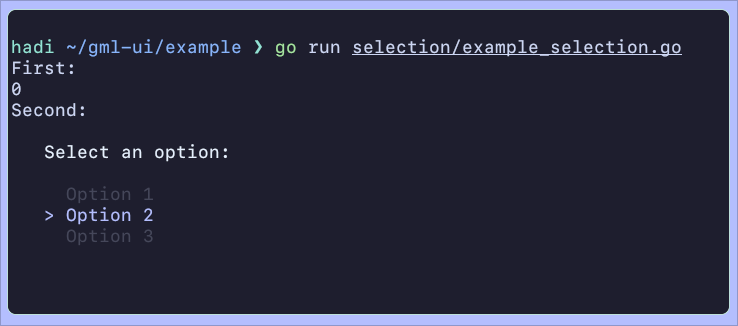

The `selection` component allows you to quickly prompt the user to choose an option.
Move with the arrow keys or JK, select an option with CR
Here is an example that provides the output mentioned above:

```go
package main

import (
	"fmt"

	"github.com/anotherhadi/gml-ui/selection"
)

func main() {
	fmt.Println("First:")
	firstResult, err := selection.Selection(selection.Settings{
		Options: []string{"Option 1", "Option 2", "Option 3"},
	})
	if err != nil {
		panic(err)
	}
	fmt.Println(firstResult)

	fmt.Println("Second:")
	secondResult, err := selection.Selection(selection.Settings{
		Options:     []string{"Option 1", "Option 2", "Option 3"},
		DontCleanup: true,
	})
	if err != nil {
		panic(err)
	}
	fmt.Println(secondResult)

}
```

### Selection with Filter

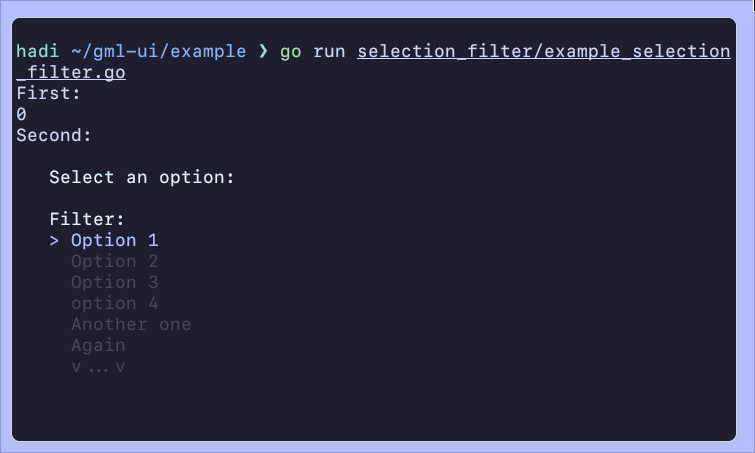

The  `selection_filter` component allows you to quickly prompt the user to choose an option.
It features a 'filter' field that enables the user to filter the available options.
This component is preferable over `selection` for a large number of options.
Move with the arrow keys or JK, select an option with CR

### Checkbox

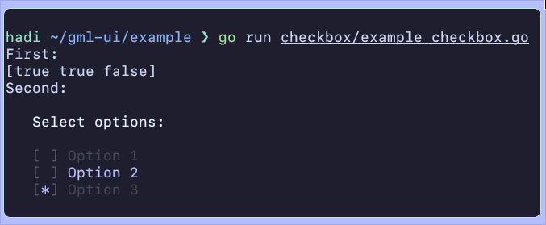

The `checkbox` component allows you to quicky prompt the user to choose multiple options.
Move with the arrow keys or JK, select an option with SPACE

### Confirm

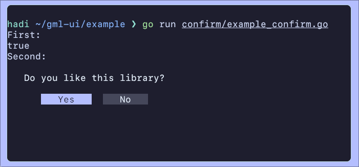

The `confirm` component allows you to quickly prompt the user to choose between Yes/No, True/False, etc..
Move with the arrow keys or HL, select an option with CR

Here is an example that provides the output mentioned above:

 ```go
package main

import (
	"fmt"

	"github.com/anotherhadi/gml-ui/confirm"
)

func main() {
	fmt.Println("First:")
	firstResult, err := confirm.Confirm()
	if err != nil {
		panic(err)
	}
	fmt.Println(firstResult)

	fmt.Println("Second:")
	secondResult, err := confirm.Confirm(confirm.Settings{
		Prompt:         "Do you like this library?",
		DefaultToFalse: true,
		DontCleanup:    true,
	})
	if err != nil {
		panic(err)
	}
	fmt.Println(secondResult)
}
```

### Confirm Inline

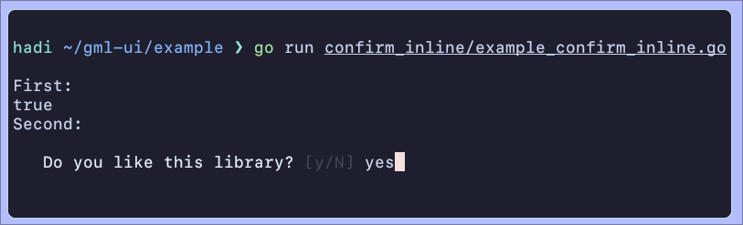

The `confirm_inline` component allows you to quickly prompt the user to choose between Yes/No, True/False, etc..

### Input


The `input` component allows you to quickly prompt the user to type a string

### Number Picker

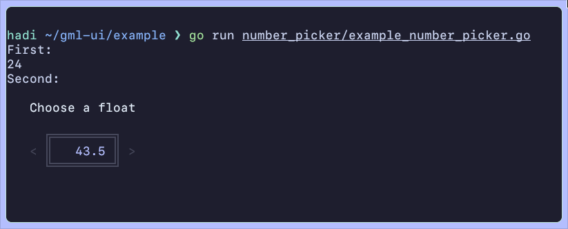

The `number_picker` component allows you to quickly prompt the user to choose a number (int or float).
Increment/Decrement with the arrow keys or HJ/KL, type a number to change the input, and validate with CR.

Example:

```go
result, err := number_picker.NumberPicker(number_picker.Settings{
	Prompt:      "Choose a float",
	DontCleanup: true,
	Decimal:     true,
})
```

## Outputs

### Paragraph

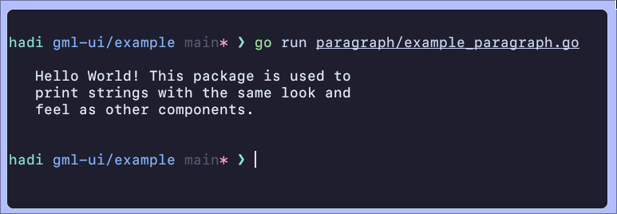

The `paragraph` component is used to print strings with the same look and feel as other components.

Example:

```go
paragraph.Paragraph("Hello World! This package is used to print strings with the same look and feel as other components.")
```

### Asciitext

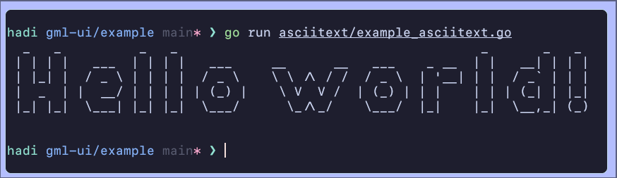

The `asciitext` component is used to print large ASCII art text.

Example:

```go
str := asciitext.AsciiText("Hello world!")
fmt.Print(str)
```

### ANSI

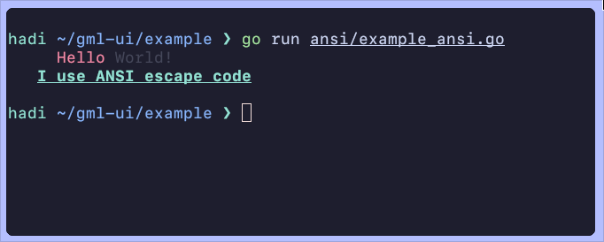

The `ansi` package provides a simple and user-friendly way to add color and formatting to terminal output in Go applications. Enhance your command-line interfaces with vibrant text, background colors, and text styles, making your output more readable and visually appealing.

Example:

```go
ansi.CursorRight(5)
fmt.Print(ansi.Red, "Hello ")
fmt.Print(ansi.FgRgb(69, 71, 90), "World!\n")
ansi.CursorRight(3)
fmt.Print(ansi.BrightCyan, ansi.Bold, ansi.Underline, "I use ANSI escape code\n")
```

### Asciimoji

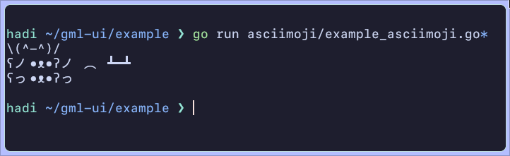

A collection of emojis made from ASCII characters. From [asciimoji](https://asciimoji.com)

Example:

```go
fmt.Println(asciimoji.Thanks)
fmt.Println(asciimoji.Bearflip)
fmt.Println(asciimoji.Bearhug)
```

### Loading

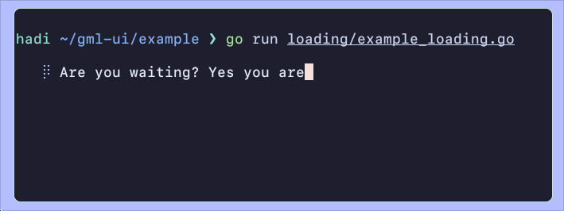

The `loading` component is a loading spinner, useful for indicating that some kind of operation is in progress.

Example:

```go
loadingChan := make(chan bool)

go loading.Loading(loadingChan, loading.Settings{
	Message:     "Are you waiting? Yes you are",
	DontCleanup: true,
})

for i := 0; i < 10; i++ {
	time.Sleep(time.Second)
}

loadingChan <- false

close(loadingChan)
fmt.Println("Work done!")
```

### Progress

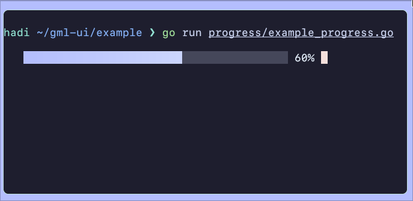

The `progress` component is a progress bar, helpful for visualizing the advancement of a task or process.

Example:

```go
percentageChan := make(chan int)

go progress.ProgressBar(percentageChan, progress.Settings{
	DontCleanup: true,
})

for i := 0; i < 10; i++ {
	percentageChan <- (i + 1) * 10
	time.Sleep(time.Second)
}

close(percentageChan)
fmt.Println("Work done!")
```

### Table

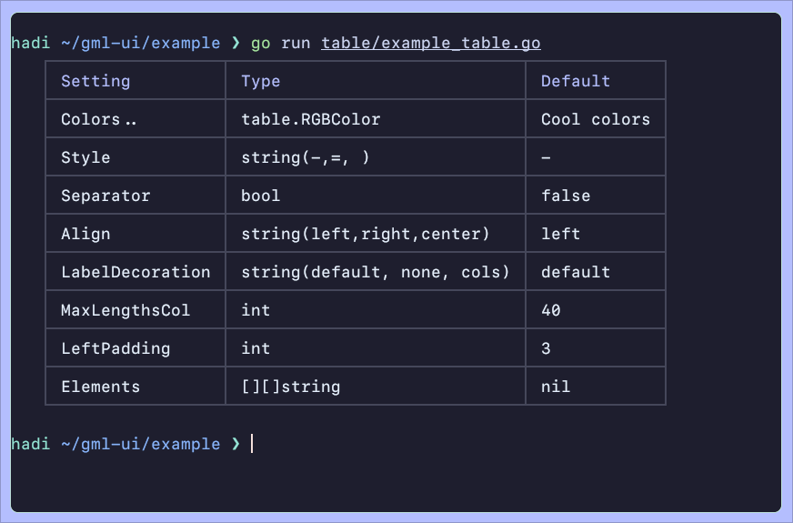

The `table` component is ideal for creating tables with columns and other features for organized data representation.

Example:

```go
var elements [][]string

elements = append(elements, []string{"Setting", "Type", "Default"})
elements = append(elements, []string{"Colors..", "table.RGBColor", "Cool colors"})
elements = append(elements, []string{"Style", "string(-,=, )", "-"})
elements = append(elements, []string{"Separator", "bool", "false"})
elements = append(elements, []string{"Align", "string(left,right,center)", "left"})
elements = append(elements, []string{"LabelDecoration", "string(default, none, cols)", "default"})
elements = append(elements, []string{"MaxLengthsCol", "int", "40"})
elements = append(elements, []string{"LeftPadding", "int", "3"})
elements = append(elements, []string{"Elements", "[][]string", "nil"})

err := table.Table(table.Settings{
	Elements:  elements,
	Separator: true,
})
if err != nil {
	panic(err)
}
```

## Utils

### Get Char

The  `getchar` package enables you to capture a single character or key input without the need for the user to press enter.

Example:

```go
ascii, arrow, err := getchar.GetChar()
if err != nil {
	panic(err)
}
fmt.Print(ascii, arrow)
```

### Get Size

The `getsize` package allows you to obtain the size in columns and rows of the terminal.

Example:

```go
cols, rows, err := getsize.GetSize()
if err != nil {
	panic(err)
}
fmt.Print(cols, rows)
```

